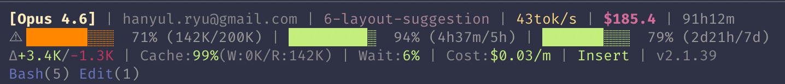
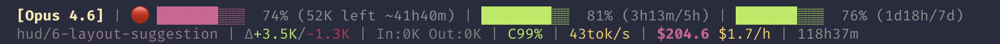

# Howl

> _"Your AI screams — Howl listens."_

A blazing-fast, feature-rich statusline HUD for [Claude Code](https://code.claude.com) written in Go. Provides real-time visibility into your AI coding session with intelligent metrics, usage tracking, and adaptive layouts.

[](https://go.dev)
[](https://github.com/ai-screams/Howl/releases)
[](https://github.com/ai-screams/Howl/releases)
[](https://github.com/ai-screams/Howl)
[](LICENSE)
[](https://github.com/ai-screams/Howl/commits)
[](https://github.com/ai-screams/Howl/graphs/commit-activity)

[](https://github.com/ai-screams/Howl/actions)
[]()
[]()
[](https://goreportcard.com/report/github.com/ai-screams/howl)
[](https://pkg.go.dev/github.com/ai-screams/howl)
[]()
[]()
[](https://conventionalcommits.org)

[]()
[]()
[]()
[](https://github.com/ai-screams/Howl/releases)
[](https://github.com/ai-screams/Howl/releases)
[](https://code.claude.com)
[]()
[](https://github.com/ai-screams/Howl/issues)

---



_Real-time statusline HUD showing 1M context session with 13 intelligent metrics_

---

## Table of Contents

- [Features](#features)
- [Installation](#installation)
- [Usage](#usage)
- [Architecture](#architecture)
- [Performance](#performance)
- [Development](#development)
- [Configuration](#configuration)
- [Uninstallation](#uninstallation)
- [Troubleshooting](#troubleshooting)
- [Why Howl?](#why-howl)
- [Roadmap](#roadmap)
- [Contributing](#contributing)
- [License](#license)
- [Credits](#credits)

---

## Features

### 📊 **Intelligent Metrics**

- **Cache Efficiency** — Track prompt cache utilization (80%+ = excellent)
- **API Wait Ratio** — See how much time spent waiting for AI responses
- **Response Speed** — Real-time tokens/second output rate
- **Cost Velocity** — Monitor spending rate ($/minute)

### 🎯 **Essential Status**

- **Model Tier Badge** — Color-coded Opus (gold) / Sonnet (cyan) / Haiku (green)
- **Context Health Bar** — Visual 20-char bar with 4-tier gradient
- **Token Absolutes** — See exact usage (210K/1M) with adaptive K/M formatting
- **Usage Quota** — Live 5h/7d limits with reset countdowns

### 🔧 **Workflow Awareness**

- **Git Integration** — Branch name + dirty status (`main*`)
- **Code Changes** — Track lines added/removed with color coding
- **Tool Usage** — Top 5 most-used tools (Read, Bash, Edit...)
- **Active Agents** — See running subagents in real-time
- **Vim Mode** — N/I/V indicators for modal editing

### 🎨 **Adaptive Layouts**

- **Normal Mode** (< 85% context) — 2-4 line display (lines added as features activate)
- **Danger Mode** (85%+ context) — Dense 2-line view with token breakdown and hourly cost
- **Smart Grouping** — Logical organization of related metrics

---

## 💾 Installation

Choose your preferred installation method:

### 🔌 Method 1: Claude Code Plugin (Recommended)

**Current Status:** Available for private repository access only. Will be available on the official Claude Marketplace after public release.

#### Via Self-hosted Marketplace

```bash
/plugin marketplace add ai-screams/Howl
/plugin install howl@ai-screams-Howl
/howl:setup
```

The `/howl:setup` skill automatically:

- Downloads the correct binary for your OS/architecture
- Installs to `~/.claude/hud/howl`
- Configures `~/.claude/settings.json`
- Backs up existing settings

After installation, use `/howl:configure` to customize your statusline display with preset configurations.

#### Via Official Marketplace (Coming Soon)

Once Howl is published to the official Claude Plugin Directory:

```bash
/plugin install howl@claude-plugin-directory
```

Or search for "howl" in `/plugin > Discover`.

---

### 📦 Method 2: Direct Binary Download

Download the latest binary from [GitHub Releases](https://github.com/ai-screams/Howl/releases/latest):

```bash
mkdir -p ~/.claude/hud

# macOS (Apple Silicon)
curl -fsSL https://github.com/ai-screams/Howl/releases/latest/download/howl_darwin_arm64 -o ~/.claude/hud/howl

# macOS (Intel)
curl -fsSL https://github.com/ai-screams/Howl/releases/latest/download/howl_darwin_amd64 -o ~/.claude/hud/howl

# Linux (x86_64)
curl -fsSL https://github.com/ai-screams/Howl/releases/latest/download/howl_linux_amd64 -o ~/.claude/hud/howl

# Linux (ARM64)
curl -fsSL https://github.com/ai-screams/Howl/releases/latest/download/howl_linux_arm64 -o ~/.claude/hud/howl

chmod +x ~/.claude/hud/howl
```

Then add to `~/.claude/settings.json`:

```json
{
  "statusLine": {
    "type": "command",
    "command": "/Users/YOUR_USERNAME/.claude/hud/howl"
  }
}
```

Verify: `~/.claude/hud/howl --version`

---

### 🛠️ Method 3: Build from Source

Prerequisites: Go 1.24+, Claude Code CLI

```bash
git clone https://github.com/ai-screams/Howl.git
cd Howl
make install
# Binary installed to ~/.claude/hud/howl
```

The Makefile automatically configures your settings.json.

---

### ✅ Post-Installation

Restart Claude Code to activate the statusline. The HUD will appear at the bottom of your terminal.

---

## Usage

Howl runs automatically as a subprocess every ~300ms. No manual interaction needed.

### Example Output

**Normal Mode (21% context, 1M):**


<details>
<summary>Text output (for accessibility)</summary>

```
[Sonnet 4.5] | ████░░░░░░░░░░░░░░░░ 21% (210K/1M) | $24.5 | 29h15m
hanyul.ryu@gmail.com | main | +328/-67 | 15tok/s | (2h)5h: 78%/88% :7d(3d21h)
Bash(2)
Cache:99% | Wait:6% | Cost:$0.01/m | I
```

</details>

**Danger Mode (100% context, 200K):**



<details>
<summary>Text output (for accessibility)</summary>

```
🔴 [Opus 4.6] | ████████████████████ 100% (200K/200K) | $24.5 | 29h17m
hud/main | +328/-67 | In:0K Out:0K Cache:212K | 15tok/s | C99% | A6% | $0.8/h | I | (2h)5h: 72%/87% :7d(3d21h)
```

</details>

### Metrics Explained

| Metric           | Meaning                                         | Color Coding                                      |
| ---------------- | ----------------------------------------------- | ------------------------------------------------- |
| **Cache:96%**    | Prompt cache efficiency (% of input from cache) | Green (80%+), Yellow (50-80%), Red (<50%)         |
| **Wait:41%**     | Time spent waiting for API responses            | Green (<35%), Yellow (35-60%), Red (60%+)         |
| **Cost:$0.19/m** | API spending rate per minute                    | Green (<$0.10), Yellow ($0.10-0.50), Red ($0.50+) |
| **50tok/s**      | Output token generation speed                   | Green (60+), Yellow (30-60), Orange (<30)         |
| **(2h)5h: 55%**  | 5-hour quota: 55% remaining, resets in 2 hours  | Gradient based on % remaining                     |
| **:7d(3d6h)**    | 7-day quota: 42% remaining, resets in 3d6h      | Gradient based on % remaining                     |

---

## Architecture

### Data Flow

```
Claude Code (every ~300ms)
    │
    ├─ Pipes JSON to stdin
    │
    ▼
┌─────────────────────────────────────┐
│  Howl Binary (Go)                   │
│                                     │
│  1. Parse stdin JSON                │
│  2. Compute derived metrics         │
│  3. Fetch git status (1s timeout)   │
│  4. Get OAuth quota (60s cache)     │
│  5. Parse transcript (last 100 ln)  │
│  6. Render ANSI output              │
│  7. Output to stdout                │
└─────────────────────────────────────┘
    │
    ▼
Claude Code Statusline Display
```

### Project Structure

```
howl/
├── cmd/
│   └── howl/
│       ├── main.go          # Entry point, orchestration
│       └── main_test.go     # Main package tests
├── internal/
│   ├── constants.go         # Threshold constants
│   ├── types.go             # StdinData structs, model classification
│   ├── types_test.go        # Types tests
│   ├── metrics.go           # Derived calculations
│   ├── metrics_test.go      # Metrics tests
│   ├── render.go            # ANSI output generation
│   ├── render_test.go       # Render tests
│   ├── config.go            # Configuration system
│   ├── config_test.go       # Config tests
│   ├── git.go               # Git subprocess calls
│   ├── git_test.go          # Git tests
│   ├── usage.go             # OAuth quota API
│   ├── usage_test.go        # Usage tests
│   ├── account.go           # Account tier detection
│   ├── account_test.go      # Account tests
│   ├── transcript.go        # JSONL parsing
│   ├── transcript_test.go   # Transcript tests
│   ├── integration_test.go  # Integration tests
│   └── testdata/            # JSONL test fixtures
├── docs/                    # Design & research documents
├── Makefile                 # Build automation
└── go.mod                   # Go module definition
```

### Key Modules

- **constants.go** — All threshold constants (danger %, cache %, speed, cost, quotas, timeouts)
- **types.go** — StdinData schema matching Claude Code's JSON output, model tier classification
- **metrics.go** — Cache efficiency, API ratio, cost velocity, response speed calculations
- **render.go** — ANSI color codes, adaptive layouts (normal 2-4 lines / danger 2 lines)
- **git.go** — Branch detection with graceful 1s timeout
- **usage.go** — Anthropic OAuth API client with session-scoped 60s caching
- **transcript.go** — Tool usage extraction from conversation history (last ~100 lines)

---

## Performance

### Benchmark Results

**Test Environment:**

- Platform: macOS (Apple Silicon)
- Go: 1.24.13
- Runs: 20 iterations (minimal), 10 iterations (full)

| Mode                     | Min  | Max     | Average  | Budget      |
| ------------------------ | ---- | ------- | -------- | ----------- |
| **Minimal** (stdin-only) | 0ms  | 20ms    | **6ms**  | 300ms (2%)  |
| **Full** (all features)  | 30ms | 510ms\* | **88ms** | 300ms (29%) |

\*First OAuth call (uncached)

### Breakdown by Feature

| Feature               | Added Latency               | Notes                     |
| --------------------- | --------------------------- | ------------------------- |
| JSON parsing + render | ~6ms                        | Base operation            |
| Git status            | +20-40ms                    | 1s timeout, graceful fail |
| Transcript parsing    | +10-30ms                    | Last 100 lines only       |
| OAuth quota           | +3s (first) / +0ms (cached) | 60s cache TTL             |

**Optimizations:**

- Compiled Go binary (no interpreter startup)
- Session-scoped caching for external API calls
- Tail-only transcript parsing (vs full file scan)
- 1-second timeout on git operations
- Zero external dependencies (stdlib only)

---

## Development

### Project Commands

```bash
make build         # Compile to build/howl
make install       # Copy to ~/.claude/hud/howl
make clean         # Remove build artifacts
make test          # Smoke test with sample JSON input
make unit-test     # Run unit tests
make release-dry   # Test GoReleaser locally (snapshot)
make release-check # Validate .goreleaser.yaml
```

### Adding New Metrics

1. Add field to `Metrics` struct in `internal/metrics.go`
2. Implement calculation function
3. Call in `ComputeMetrics()`
4. Add render function in `internal/render.go`
5. Integrate into layout (normal/danger modes)

Example:

```go
// metrics.go
type Metrics struct {
    // ...
    NewMetric *int
}

func calcNewMetric(d *StdinData) *int {
    // calculation logic
}

// render.go
func renderNewMetric(val int) string {
    return fmt.Sprintf("%s%d%s", color, val, Reset)
}
```

---

## ⚙️ Configuration

### OAuth Credentials

Howl automatically reads OAuth tokens from macOS Keychain:

- Service: `Claude Code-credentials`
- Extracted field: `claudeAiOauth.accessToken`

No manual configuration needed if Claude Code is authenticated.

### Cache Locations

- **Usage quota cache:** `$TMPDIR/howl-{session_id}/usage.json` (60s TTL)
- **Session-scoped:** Each Claude Code session has isolated cache via `session_id`

---

## 🗑️ Uninstallation

### If installed via Plugin

```bash
/plugin uninstall howl@ai-screams-Howl
```

This removes the plugin but keeps the binary. To remove everything:

```bash
/plugin uninstall howl@ai-screams-Howl
rm ~/.claude/hud/howl
```

Then remove the `statusLine` field from `~/.claude/settings.json`.

### If installed manually

1. Remove binary: `rm ~/.claude/hud/howl`
2. Remove `statusLine` field from `~/.claude/settings.json`
3. Restart Claude Code

---

## 🔍 Troubleshooting

### Quota shows `?`

- OAuth API unavailable or credentials expired
- Check: `security find-generic-password -s "Claude Code-credentials" -w`
- Fallback: Quota display is optional, other metrics still work

### Git branch not showing

- Not a git repository
- Git timeout (1s) exceeded
- Solution: Initialize git or ignore (graceful degradation)

### Tools line empty

- Transcript file not accessible
- Session just started (no tools used yet)
- Solution: Wait for tool usage or check transcript path

### Performance slower than expected

- Large transcript file (>10MB)
- Network latency for OAuth API
- Solution: Transcript parses last 100 lines only, quota cached for 60s

---

## Why Howl?

Howl was created to solve specific pain points with existing Claude Code statusline tools.

### Comparison

| Feature            | claude-hud        | Howl               |
| ------------------ | ----------------- | ------------------ |
| Cold start         | ~70ms (Node.js)   | ~10ms (Go)         |
| Dependencies       | npm ecosystem     | Zero (stdlib only) |
| Context display    | % only            | Absolute (500K/1M) |
| Metrics count      | 3-5               | 13                 |
| 1M context support | ❌                | ✅                 |
| Session isolation  | ❌ Global cache   | ✅ Per session_id  |
| OAuth quota        | ❌ Missing header | ✅ Correct API     |

### What Makes Howl Different

- **Session isolation** — Cache per `session_id`, preventing cross-session bugs
- **OAuth headers** — Correct `anthropic-beta` header included for API access
- **Rich metrics** — 13 distinct indicators across 2-4 display lines
- **Go performance** — ~10ms cold start, 5.2MB binary, zero dependencies
- **1M context ready** — Adaptive K/M formatting for large windows

---

## 🗺️ Roadmap

- [x] Configuration file support (`~/.claude/hud/config.json`) — _Available in v1.3.0+_
- [ ] Custom color schemes
- [ ] Plugin system for custom metrics
- [ ] Windows support

---

## 🤝 Contributing

This is a personal tool for the AiScream project. Feedback and bug reports welcome!

---

## 📄 License

MIT License — see [LICENSE](LICENSE) file for details.

For release history and detailed changes, see [CHANGELOG.md](CHANGELOG.md).

---

## 💝 Credits

**Project:** [ai-screams/Howl](https://github.com/ai-screams/Howl)
**Author:** pignuante
**Inspired by:** [claude-hud](https://github.com/jarrodwatts/claude-hud) by Jarrod Watts

Built with ❤️ and Claude Code.
