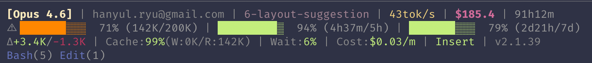
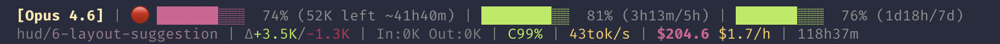

# Howl

> _"Your AI screams — Howl listens."_

A blazing-fast, feature-rich statusline HUD for [Claude Code](https://code.claude.com) written in Go. Provides real-time visibility into your AI coding session with intelligent metrics, usage tracking, and adaptive layouts.

[](https://go.dev)
[](https://github.com/ai-screams/howl/releases)
[](https://github.com/ai-screams/howl/releases)
[](https://github.com/ai-screams/howl)
[](LICENSE)
[](https://github.com/ai-screams/howl/commits)
[](https://github.com/ai-screams/howl/graphs/commit-activity)

[](https://github.com/ai-screams/howl/actions)
[]()
[]()
[](https://goreportcard.com/report/github.com/ai-screams/howl)
[](https://pkg.go.dev/github.com/ai-screams/howl)
[]()
[]()
[](https://conventionalcommits.org)

[]()
[]()
[]()
[](https://github.com/ai-screams/howl/releases)
[](https://github.com/ai-screams/howl/releases)
[](https://code.claude.com)
[]()
[](https://github.com/ai-screams/howl/issues)

---



_Real-time statusline HUD showing 1M context session with 13 intelligent metrics_

---

## Table of Contents

- [Features](#features)
- [Installation](#installation)
- [Updating](#updating-)
- [Uninstallation](#uninstallation)
- [Usage](#usage)
- [Architecture](#architecture)
- [Performance](#performance)
- [Development](#development)
- [Configuration](#configuration)
  - [Custom Thresholds](#custom-thresholds)
- [Troubleshooting](#troubleshooting)
- [Why Howl?](#why-howl)
- [Roadmap](#roadmap)
- [Contributing](#contributing)
- [License](#license)
- [Credits](#credits)

---

## Features

### Intelligent Metrics 📊

- **Cache Efficiency** — Track prompt cache utilization (80%+ = excellent)
- **API Wait Ratio** — See how much time spent waiting for AI responses
- **Cost Velocity** — Monitor spending rate ($/minute)

### Essential Status 🎯

- **Model Tier Badge** — Color-coded Opus (gold) / Sonnet (cyan) / Haiku (green)
- **Context Health Bar** — Visual 10-char bar with 4-tier gradient
- **Token Absolutes** — See exact usage (210K/1M) with adaptive K/M formatting
- **Usage Quota** — Live 5h/7d limits with reset countdowns (reads `rate_limits` from stdin; requires Claude.ai subscriber + CC 2.1.80+)

### Workflow Awareness 🔧

- **Git Integration** — Branch name + dirty status (`main*`)
- **Code Changes** — Track lines added/removed with color coding
- **Tool Usage** — Top 5 most-used tools (Read, Bash, Edit...)
- **Active Agents** — See running subagents in real-time
- **Vim Mode** — N/I/V indicators for modal editing

### Custom Thresholds ⚡

- **15 Configurable Values** — Control when every color changes and when danger mode activates
- **Per-Group Tuning** — Context, cost, cache, API wait, cost velocity, quota
- **Interactive Setup** — Use `/howl:threshold` to adjust values conversationally
- **Safe Defaults** — Invalid values auto-corrected, zero values ignored

### Optional Feature Toggles (default off) 🔧

Enable individually via `features` in `~/.claude/hud/config.json` or `/howl:customize`:

- **output_tokens** — Current-response output token count (`Out:1K`) — truthful replacement for the removed tok/s metric; reads `current_usage.output_tokens` directly
- **effort** — Shows current effort level (`E:high`)
- **thinking** — Shows extended thinking indicator (`Think`)
- **session_name** — Shows truncated session name
- **pull_request** — Shows linked PR (`PR#1234 pending`)
- **worktree** — Shows active git worktree (`wt:name`)

### Adaptive Layouts 🎨

- **Normal Mode** (< 85% context, configurable) — 2-4 line display (lines added as features activate)
- **Danger Mode** (85%+ context, configurable) — Dense 2-line view with token breakdown and hourly cost
- **Smart Grouping** — Logical organization of related metrics
- **Width-Aware Rendering** — Tool/agent line sizes to `COLUMNS` env var (clamped 40–240, fallback 80; requires CC 2.1.153+)

---

<a name="installation"></a>

## Installation 💾

Choose your preferred installation method:

### Method 1: Claude Code Plugin (Recommended) 🔌

**Current Status:** Available for private repository access only. Will be available on the official Claude Marketplace after public release.

#### Via Self-hosted Marketplace

```bash
/plugin marketplace add ai-screams/howl
/plugin install howl@ai-screams-howl
/howl:setup
```

The `/howl:setup` skill automatically:

- Downloads the correct binary for your OS/architecture
- Installs to `~/.claude/hud/howl`
- Configures `~/.claude/settings.json`
- Backs up existing settings

After installation, use `/howl:configure` to choose a preset, `/howl:customize` for fine-grained metric toggles and priority ordering, or `/howl:threshold` to tune color breakpoints and danger mode trigger.

#### Via Official Marketplace (Coming Soon)

Once Howl is published to the official Claude Plugin Directory:

```bash
/plugin install howl@claude-plugin-directory
```

Or search for "howl" in `/plugin > Discover`.

---

### Method 2: Direct Binary Download 📦

Download the latest binary from [GitHub Releases](https://github.com/ai-screams/howl/releases/latest):

```bash
mkdir -p ~/.claude/hud

# macOS (Apple Silicon)
curl -fsSL https://github.com/ai-screams/howl/releases/latest/download/howl_darwin_arm64 -o ~/.claude/hud/howl

# macOS (Intel)
curl -fsSL https://github.com/ai-screams/howl/releases/latest/download/howl_darwin_amd64 -o ~/.claude/hud/howl

# Linux (x86_64)
curl -fsSL https://github.com/ai-screams/howl/releases/latest/download/howl_linux_amd64 -o ~/.claude/hud/howl

# Linux (ARM64)
curl -fsSL https://github.com/ai-screams/howl/releases/latest/download/howl_linux_arm64 -o ~/.claude/hud/howl

chmod +x ~/.claude/hud/howl
```

Then add to `~/.claude/settings.json`:

```json
{
  "statusLine": {
    "type": "command",
    "command": "/Users/YOUR_USERNAME/.claude/hud/howl"
  }
}
```

Verify: `~/.claude/hud/howl --version`

---

### Method 3: Build from Source 🛠️

Prerequisites: Go 1.24+, Claude Code CLI

```bash
git clone https://github.com/ai-screams/howl.git
cd Howl
make install
# Binary installed to ~/.claude/hud/howl
```

The Makefile automatically configures your settings.json.

---

### Post-Installation ✅

Restart Claude Code to activate the statusline. The HUD will appear at the bottom of your terminal.

---

## Updating 🔄

### If installed via Plugin

```bash
/howl:setup
```

Re-running the setup skill downloads the latest binary and replaces the existing one. Your configuration (`~/.claude/hud/config.json`) is preserved.

### If installed via Direct Download

Re-download the latest binary:

```bash
curl -fsSL https://github.com/ai-screams/howl/releases/latest/download/howl_$(uname -s | tr '[:upper:]' '[:lower:]')_$(uname -m | sed 's/x86_64/amd64/;s/aarch64/arm64/') \
  -o ~/.claude/hud/howl && chmod +x ~/.claude/hud/howl
```

### If built from Source

```bash
cd howl && git pull && make install
```

No restart needed — changes apply on the next refresh (~300ms).

---

<a name="uninstallation"></a>

## Uninstallation 🗑️

### If installed via Plugin

```bash
/plugin uninstall howl@ai-screams-howl
```

This removes the plugin but keeps the binary. To remove everything:

```bash
/plugin uninstall howl@ai-screams-howl
rm ~/.claude/hud/howl
```

Then remove the `statusLine` field from `~/.claude/settings.json`.

### If installed manually

1. Remove binary: `rm ~/.claude/hud/howl`
2. Remove `statusLine` field from `~/.claude/settings.json`
3. Restart Claude Code

---

## Usage

Howl runs automatically as a subprocess every ~300ms. No manual interaction needed.

### Example Output

**Normal Mode (21% context, 1M):**


<details>
<summary>Text output (for accessibility)</summary>

```
🟢 Sonnet 4.5 1M | hanyul.ryu@gmail.com | main | $24.5 | 29h15m
██░░░░░░░░  21% (210K/  1M) | ████████░░  78% (2h00m/5h) | █████████░  88% (3d21h/7d)
+328 -67 | Cache 99% (R:180K W:30K) | Wait 6% | $0.01/m | Out:1K | VIM:I | CC 1.0.18
Bash(2)
```

</details>

**Danger Mode (100% context, 200K):**



<details>
<summary>Text output (for accessibility)</summary>

```
🟣 Opus 4.6 | 🔴 ██████████ 100% 0K left ~0m | ████████░░  72% (2h00m/5h)
main | +328 -67 | Cache 99% | Wait 6% | $0.01/m
```

</details>

### Metrics Explained

| Metric              | Meaning                                                                         | Color Coding                                                                         |
| ------------------- | ------------------------------------------------------------------------------- | ------------------------------------------------------------------------------------ |
| **Cache 96%**       | Prompt cache efficiency (% of input from cache)                                 | Green (80%+), Yellow (50-80%), Red (<50%)                                            |
| **Wait 41%**        | Time spent waiting for API responses                                            | Green (<35%), Yellow (35-60%), Red (60%+)                                            |
| **$0.19/m**         | API spending rate per minute                                                    | Green (<$0.10), Yellow ($0.10-0.50), Red ($0.50+)                                    |
| **Out:1K**          | Output tokens for the current response                                          | Static (no color coding; opt-in via `output_tokens` toggle)                          |
| **78% (2h00m/5h)**  | 5-hour quota: 78% remaining, resets in 2h                                       | Gradient based on % remaining                                                        |
| **88% (3d21h/7d)**  | 7-day quota: 88% remaining, resets in 3d21h                                     | Gradient based on % remaining                                                        |
| **🔥 on quota bar** | Quota window is ahead of even pace — projected to be exhausted before it resets | Appended to the quota bar; no separate toggle (shows under existing `quota` feature) |

> **Tip:** All color thresholds above are defaults. You can customize every breakpoint via `/howl:threshold` or `~/.claude/hud/config.json`. See [Custom Thresholds](#custom-thresholds) below.

> **Note:** The context window percentage shown by Howl reflects the raw `used_percentage` from Claude Code's stdin JSON. This does **not** account for the auto-compact buffer (~10-17% reserved internally by Claude Code). Actual free context before auto-compaction triggers may be lower than displayed. This is a Claude Code limitation — the auto-compact threshold is not exposed in the statusline JSON schema.

---

## Architecture

### Data Flow

```
Claude Code (every ~300ms)
    │
    ├─ Pipes JSON to stdin (includes rate_limits for quota)
    │
    ▼
┌─────────────────────────────────────┐
│  Howl Binary (Go)                   │
│                                     │
│  1. Parse stdin JSON                │
│  2. Compute derived metrics         │
│  3. Fetch git status (1s timeout)   │
│  4. Convert rate_limits → quota     │
│  5. Parse transcript (last 100 ln)  │
│  6. Render ANSI output              │
│  7. Output to stdout                │
└─────────────────────────────────────┘
    │
    ▼
Claude Code Statusline Display
```

### Project Structure

```
howl/
├── cmd/
│   └── howl/
│       ├── main.go          # Entry point, orchestration
│       └── main_test.go     # Main package tests
├── internal/
│   ├── constants.go         # Threshold constants
│   ├── types.go             # StdinData structs, model classification
│   ├── types_test.go        # Types tests
│   ├── metrics.go           # Derived calculations
│   ├── metrics_test.go      # Metrics tests
│   ├── render.go            # ANSI output generation
│   ├── render_test.go       # Render tests
│   ├── config.go            # Configuration system
│   ├── config_test.go       # Config tests
│   ├── git.go               # Git subprocess calls
│   ├── git_test.go          # Git tests
│   ├── usage.go             # rate_limits → quota converter (no I/O)
│   ├── usage_test.go        # Usage tests
│   ├── account.go           # Account tier detection
│   ├── account_test.go      # Account tests
│   ├── transcript.go        # JSONL parsing
│   ├── transcript_test.go   # Transcript tests
│   ├── integration_test.go  # Integration tests
│   └── testdata/            # JSONL test fixtures
├── docs/                    # Design & research documents
├── skills/
│   ├── setup/SKILL.md       # /howl:setup (installation)
│   ├── configure/SKILL.md   # /howl:configure (preset selection)
│   ├── customize/SKILL.md   # /howl:customize (metric toggles)
│   └── threshold/SKILL.md   # /howl:threshold (color thresholds)
├── .claude-plugin/          # Claude Code plugin metadata
├── Makefile                 # Build automation
└── go.mod                   # Go module definition
```

### Key Modules

- **constants.go** — Default threshold constants (danger %, cache %, speed, cost, quotas, timeouts)
- **config.go** — Configuration system with presets, feature toggles, and 17 customizable thresholds
- **types.go** — StdinData schema matching Claude Code's JSON output, model tier classification
- **metrics.go** — Cache efficiency, API ratio, cost velocity calculations
- **render.go** — ANSI color codes, adaptive layouts (normal 2-4 lines / danger 2 lines), threshold-driven colors
- **git.go** — Branch detection with graceful 1s timeout
- **usage.go** — Pure `rate_limits` → quota converter (no network/Keychain/cache)
- **transcript.go** — Tool usage extraction from conversation history (last ~100 lines)

---

## Performance

### Benchmark Results

**Test Environment:**

- Platform: macOS (Apple Silicon)
- Go: 1.24.13
- Runs: 20 iterations (minimal), 10 iterations (full)

| Mode                     | Min  | Max  | Average  | Budget      |
| ------------------------ | ---- | ---- | -------- | ----------- |
| **Minimal** (stdin-only) | 0ms  | 20ms | **6ms**  | 300ms (2%)  |
| **Full** (all features)  | 30ms | 80ms | **45ms** | 300ms (15%) |

### Breakdown by Feature

| Feature               | Added Latency | Notes                                       |
| --------------------- | ------------- | ------------------------------------------- |
| JSON parsing + render | ~6ms          | Base operation                              |
| Git status            | +20-40ms      | 1s timeout, graceful fail                   |
| Transcript parsing    | +10-30ms      | Last 100 lines only                         |
| Quota (rate_limits)   | +0ms          | Parsed directly from stdin, no network call |

**Optimizations:**

- Compiled Go binary (no interpreter startup)
- Quota read directly from stdin (no network call, no caching needed)
- Tail-only transcript parsing (vs full file scan)
- 1-second timeout on git operations
- Zero external dependencies (stdlib only)

---

## Development

### Project Commands

```bash
make build         # Compile to build/howl
make install       # Copy to ~/.claude/hud/howl
make clean         # Remove build artifacts
make test          # Smoke test with sample JSON input
make unit-test     # Run unit tests
make release-dry   # Test GoReleaser locally (snapshot)
make release-check # Validate .goreleaser.yaml
```

### Adding New Metrics

1. Add field to `Metrics` struct in `internal/metrics.go`
2. Implement calculation function
3. Call in `ComputeMetrics()`
4. Add render function in `internal/render.go`
5. Integrate into layout (normal/danger modes)

Example:

```go
// metrics.go
type Metrics struct {
    // ...
    NewMetric *int
}

func calcNewMetric(d *StdinData) *int {
    // calculation logic
}

// render.go
func renderNewMetric(val int) string {
    return fmt.Sprintf("%s%d%s", color, val, Reset)
}
```

---

<a name="configuration"></a>

## Configuration ⚙️

### Custom Thresholds

All 15 color breakpoints and the danger mode trigger are configurable via `~/.claude/hud/config.json`:

```json
{
  "preset": "full",
  "thresholds": {
    "context_danger": 92,
    "context_warning": 80,
    "session_cost_high": 20.0,
    "quota_high": 90
  }
}
```

Only specified values override defaults — omitted fields keep their default values.

| Group             | Thresholds                                                  | Defaults                     | Effect                                       |
| ----------------- | ----------------------------------------------------------- | ---------------------------- | -------------------------------------------- |
| **Context**       | `context_danger`, `context_warning`, `context_moderate`     | 85%, 70%, 50%                | Danger mode trigger, warning/moderate colors |
| **Session Cost**  | `session_cost_high`, `session_cost_medium`                  | $5.00, $1.00                 | Cost display color                           |
| **Cache**         | `cache_excellent`, `cache_good`                             | 80%, 50%                     | Cache efficiency color                       |
| **API Wait**      | `wait_high`, `wait_medium`                                  | 60%, 35%                     | API wait ratio color                         |
| **Cost Velocity** | `cost_velocity_high`, `cost_velocity_medium`                | $0.50, $0.10/min             | Cost velocity color                          |
| **Quota**         | `quota_critical`, `quota_low`, `quota_medium`, `quota_high` | 10%, 25%, 50%, 75% remaining | Quota color bands                            |

**Interactive setup:** Run `/howl:threshold` in Claude Code to adjust values conversationally — choose a group, set values, and see before/after comparisons.

**Validation:** Invalid values are auto-corrected (inverted pairs clamped, out-of-range values bounded). Zero or negative values are ignored. Malformed JSON falls back to all defaults silently.

Changes apply on the next refresh (~300ms) — no restart needed.

---

<a name="troubleshooting"></a>

## Troubleshooting 🔍

### Quota shows `?` or is absent

- Not a Claude.ai subscriber (quota only available for subscribers)
- Before the first API response in the session (quota field appears after the first call)
- Claude Code older than 2.1.80 (the `rate_limits` stdin field was added in 2.1.80)
- Each quota window (`five_hour`/`seven_day`) can be independently absent — no bar renders for that window rather than showing a fake 0%
- Fallback: Quota display is optional, all other metrics still work

### Git branch not showing

- Not a git repository
- Git timeout (1s) exceeded
- Solution: Initialize git or ignore (graceful degradation)

### Tools line empty

- Transcript file not accessible
- Session just started (no tools used yet)
- Solution: Wait for tool usage or check transcript path

### Performance slower than expected

- Large transcript file (>10MB)
- Solution: Transcript parses last 100 lines only; quota has zero latency (read from stdin)

---

## Why Howl?

Howl was created to solve specific pain points with existing Claude Code statusline tools.

### Comparison

| Feature            | claude-hud      | Howl                         |
| ------------------ | --------------- | ---------------------------- |
| Cold start         | ~70ms (Node.js) | ~10ms (Go)                   |
| Dependencies       | npm ecosystem   | Zero (stdlib only)           |
| Context display    | % only          | Absolute (500K/1M)           |
| Metrics count      | 3-5             | 13                           |
| 1M context support | ❌              | ✅                           |
| Quota source       | ❌ Missing      | ✅ stdin `rate_limits` field |

### What Makes Howl Different

- **Zero-latency quota** — Reads `rate_limits` directly from stdin (no network call, no Keychain)
- **Rich metrics** — 13 distinct indicators across 2-4 display lines
- **Go performance** — ~10ms cold start, 5.6MB binary, zero dependencies
- **1M context ready** — Adaptive K/M formatting for large windows
- **Width-aware rendering** — Tool/agent line adapts to terminal width via `COLUMNS`

---

<a name="roadmap"></a>

## Roadmap 🗺️

- [x] Configuration file support (`~/.claude/hud/config.json`) — _Available in v1.3.0+_
- [x] Auto-sync plugin.json version in release pipeline — _Available in v1.4.0+_
- [x] Custom thresholds — 17 configurable color breakpoints and danger mode trigger — _Available in v1.5.0+_
- [ ] Custom color schemes
- [ ] Plugin system for custom metrics
- [ ] Windows support

---

<a name="contributing"></a>

## Contributing 🤝

This is a personal tool for the AiScream project. Feedback and bug reports welcome!

---

<a name="license"></a>

## License 📄

MIT License — see [LICENSE](LICENSE) file for details.

For release history and detailed changes, see [CHANGELOG.md](CHANGELOG.md).

---

<a name="credits"></a>

## Credits 💝

**Project:** [ai-screams/howl](https://github.com/ai-screams/howl)<br>
**Author:** pignuante<br>
**Inspired by:** [claude-hud](https://github.com/jarrodwatts/claude-hud) by Jarrod Watts

Built with ❤️ and Claude Code.
